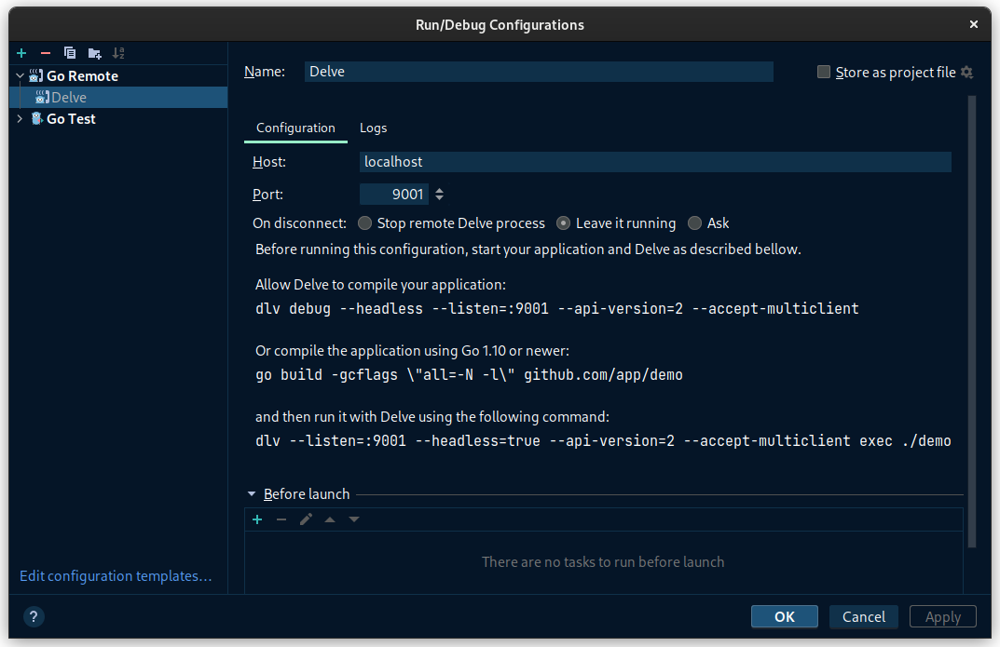

# Alfred

Alfred is a debugging utility created on top of the de-facto golang debugger, Delve. It allows the user to, seamlessly:
 * **inject** Delve into the target container that's running the target binary (that needs to be debugged),
 * **attach** in-cluster Delve to the target process,
 * **relay** debugging information to the user's local Delve instance (IDE or terminal).

### Prerequisites

* [`kubectl`](https://kubernetes.io/docs/tasks/tools/install-kubectl/)
* [`delve`](https://github.com/go-delve/delve/releases)

All prerequisites will be installed if they are not already present.

# Usage

Alfred can be used in the following ways:
* IDE: Create a remote golang debugger configuration in your respective IDE, that points to the forwarded port (`--port`).
  * NOTE: Most IDEs assume same `--target-port` and `--port` values.

Screenshot

* Terminal: Connect to the forwarded debugging port in the in-cluster environment using the command below.
  * `dlv connect "127.0.0.1:${TARGET_PORT}" --accept-multiclient --api-version 2 --check-go-version --headless --only-same-user false`